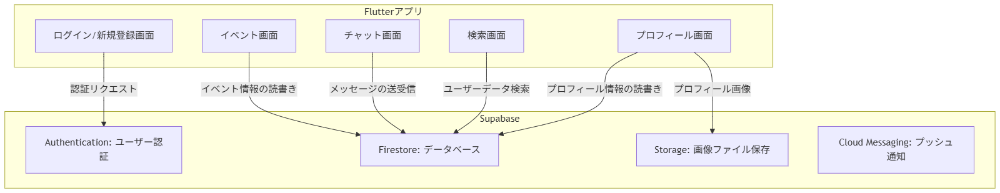
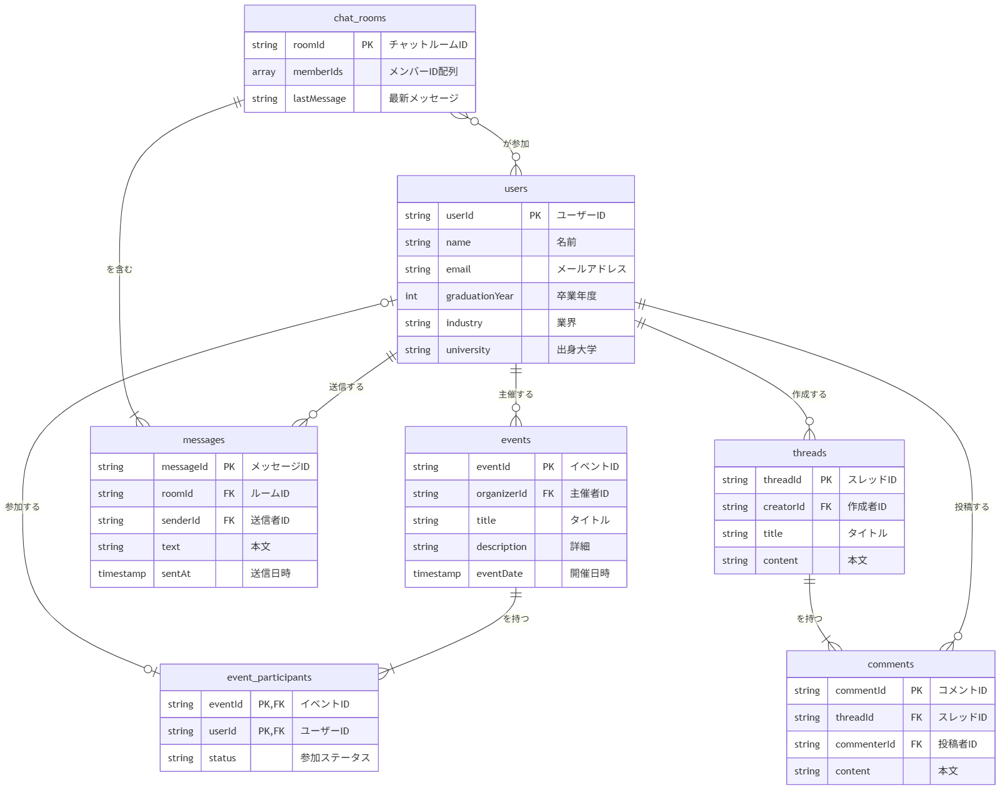

# OB 会アプリケーション開発事業 仕様書

## 序文

本書は、OB 会アプリケーション開発事業に関する全体設計思想ならびに開発規約を定義するものである 。本開発事業に従事する全ての関係者は、作業着手前に本書を熟読し、その内容を完全に理解することが要求される。

---

## 1. 事業概要

### 1.1. 成果物の目的

本アプリケーションは、卒業生間における相互交流の促進を企図し、所属世代や活動業界といった属性を超越した、有益な関係性の構築を可能たらしめる基盤として機能することをその主たる目的とする 。

- **人的ネットワーク活用の円滑化:** 多様な業界において活動する卒業生の情報を体系的に集約し、アクセス可能な状態にすることで、専門的キャリア形成に資する人的関係の構築を支援する 。
- **後進に対する支援の提供:** 在校生及び若手卒業生が、経験豊富な卒業生の有する知見へ容易にアクセスできる機構を提供し、彼らのキャリア形成を支援する 。
- **共同体の活性化:** 各種会合の企画及び募集プロセスを簡素化することにより、世代や業界の垣根を超えた交流を誘発し、共同体全体の活性化に寄与する 。

### 1.2. 開発基盤

- **クライアントサイド:** Flutter
  - 本技術の採用により、iOS 及び Android オペレーティングシステム双方に対応するネイティブアプリケーションの効率的な開発が実現される 。
- **サーバーサイド:** Supabase
  - 高い信頼性及び拡張性を有する PostgreSQL を基盤としたサービスの利用により、開発速度の向上とインフラストラクチャ管理コストの低減が図られる 。

---

## 2. 製品仕様

### 2.1. 機能要件定義

開発は段階的に実施されるものとし、初期段階においては、製品として最低限の価値を提供しうる中核的機能群（Minimum Viable Product）の実装が完了される 。後続の機能拡張は、市場投入後の利用状況を分析した上で決定される 。

#### 第一段階実装 (MVP)

- **利用者認証機能:** 電子メールアドレス及びパスワードを利用した新規登録ならびにログイン認証機構 。
- **属性情報管理機能:** 利用者自身の属性（卒業年度、居住地、所属業界、出身大学、所属部活動等）に関する情報の登録、編集、及び閲覧機能 。
- **利用者検索機能:** 登録済みの属性情報を基に、指定された条件に合致する他の利用者を検索・抽出する機能 。
- **個別通信機能:** 特定の利用者間で、秘匿性の保持されたメッセージの送受信を可能とする機能 。
- **会合管理機能:** 利用者が会合（同窓会、食事会等）を企画・募集し、他の利用者がそれに参加申請を行うことを可能とする一連の機能 。

#### 第二段階以降実装

- **外部サービス連携機能:** 利用者情報を、第三者が提供するソーシャル・ネットワーキング・サービスのアカウントと連携させる機能 。
- **集団通信機能:** 特定の属性を共有する複数の利用者間で、閉鎖的な情報交換を可能とする集団通信室を生成・管理する機能 。
- **公開掲示板機能:** 特定の主題に基づき、全利用者が情報の閲覧及び投稿を可能とする公開討論の場を提供する機能 。

### 2.2. 非機能要件定義

- **対応オペレーティングシステム:** iOS 14.0 以降、Android 8.0 以降。
- **性能:** 各画面要素の描画処理は、利用者からの要求起点で 2 秒以内に完了することが規定される。
- **安全性:** Supabase の行単位セキュリティ（Row Level Security）ポリシーを全面的に適用し、正当な権限に基づかないデータアクセスの一切を遮断する。

---

## 3. 利用者インターフェース設計

### 3.1. 画面遷移設計図

アプリケーションの主要な画面は、画面下部に恒常的に表示されるナビゲーションバーを起点として構成される 。

- **ホーム画面:** 運営からの告知事項や新規イベント情報など、最新情報が集約・表示される 。
- **検索画面:** 指定されたキーワードや属性に基づき、登録利用者を検索する 。
- **イベント画面:** イベントの一覧表示、新規作成、及び参加予定の確認を実行する 。
- **メッセージ画面:** 個別及び集団の通信室一覧を表示する 。
- **マイページ画面:** 利用者自身の属性情報の編集や、各種設定の変更を管理する 。
  

### 3.2. 設計体系

- **UI 設計用具:** Figma
- **設計資料所在:**
- **基調配色:** 未定
- **強調配色:** 未定
- **標準書体:** 未定

---

## 4. 技術設計

### 4.1. クライアントサイド技術仕様 (Flutter)

#### 4.1.1. ソフトウェアアーキテクチャ

本開発においては、Riverpod と Clean Architecture の設計思想を基盤とする階層化アーキテクチャが採用される。この選定は、責務の分離原則を厳格に適用することにより、テストの容易性及び保守性の向上を達成することを目的とするものである。

- **プレゼンテーション層:** 利用者インターフェース（Widget）及び状態管理（Notifier）の責務を担う。
- **ドメイン層:** アプリケーションの事業論理（Usecase/Interactor）及び中核モデル（Entity）の定義を担う。本層は、特定のフレームワークへの依存を完全に排除した純粋な Dart 言語によって記述される。
- **データ層:** データソース（外部 API、ローカルデータベース等）との通信及びデータ永続化の責務を担う。リポジトリパターンの実装を含む。

#### 4.1.2. 状態管理

状態管理には Riverpod が採用される。依存性注入コンテナとして機能させ、各層間の結合度を低減させる。状態の伝播及び更新には、`NotifierProvider`及び`FutureProvider`が主として利用される。

#### 4.1.3. ディレクトリ構造規定

ディレクトリ構造は、機能単位での分割を基本とする Feature-First アプローチに基づき規定される。

```
lib
├── core/
├── data/
│   ├── models/
│   ├── repositories/
│   └── providers.dart
├── domain/
│   ├── entities/
│   ├── repositories/
│   └── usecases/
├── presentation/
│   ├── features/
│   │   ├── auth/
│   │   └── ...
│   └── widgets/
└── main.dart
```

#### 4.1.4. 主要外部ライブラリ

- **HTTP 通信:** `dio`
- **DI/状態管理:** `flutter_riverpod`
- **コード生成:** `freezed`, `riverpod_generator`
- **画面遷移管理:** `go_router`

### 4.2. サーバーサイド技術仕様 (Supabase)

#### 4.2.1. データベース設計

ER 図については、関連資料に記載された図を参照のこと。

#### 4.2.2. テーブル定義

- `users`
- `events`
- `event_participants`
- `chat_rooms`
- `messages`
- _（詳細仕様は別途テーブル定義書に記載）_
  

#### 4.2.3. データアクセス制御規定 (RLS)

行単位セキュリティ（Row Level Security）は、全てのテーブルにおいて有効化される。基本方針は以下の通りとする。

- **認証の必須化:** 認証済みの利用者に限り、データへのアクセス権限が付与される。
- **読取 (SELECT):** 利用者は、自身に帰属する情報、または公開が許可された情報に限り、閲覧を許可される。
- **書込 (INSERT):** 利用者は、自身の識別子に紐づくデータに限り、作成を許可される。
- **更新 (UPDATE) / 削除 (DELETE):** 利用者は、自身が作成したデータに限り、更新及び削除を許可される。

---

## 5. 開発及び運用

### 5.1. バージョン管理戦略

バージョン管理には GitHub Flow が採用される。

1. `main`ブランチは、いかなる時点においても、製品としてリリース可能な完全性を維持しなければならない。
2. 新機能の開発及び不具合の修正は、`main`ブランチから派生した個別ブランチ（例: `feature/xxx`, `fix/xxx`）上で実施される。
3. 作業完了後、Pull Request が作成され、査読プロセスを経て`main`ブランチへ統合される。

### 5.2. 品質保証方針

- **単体テスト:** ドメイン層に定義された事業論理を中心に実施される。
- **ウィジェットテスト:** 主要画面及び共通コンポーネントの描画・操作に関して実施される。
- **コード網羅率:** 全体で 70%以上を目標値とする。

### 5.3. 継続的インテグレーション及び継続的デリバリー (CI/CD)

CI/CD パイプラインは GitHub Actions を利用して構築される。

- `main`ブランチへのプッシュをトリガーとして、テスト及びビルドの自動実行が起動される。
- 将来的には、アプリケーションストア（TestFlight/Google Play Console）への自動配備も実装範囲に含めることが検討される。
# azabu_kaze
# azabunokaze
